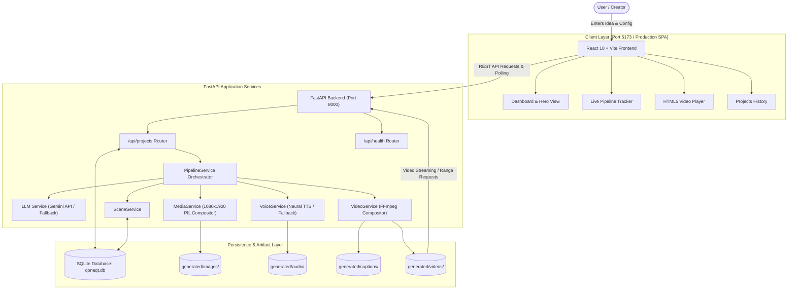
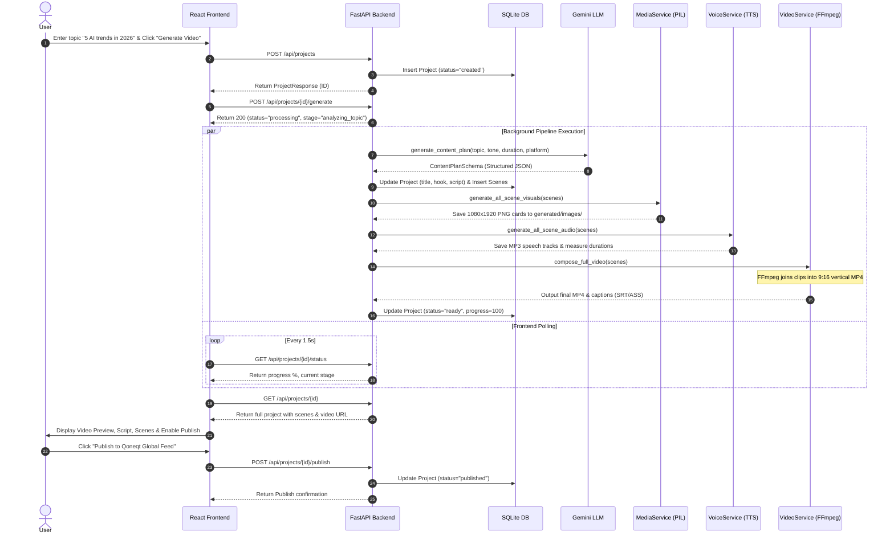
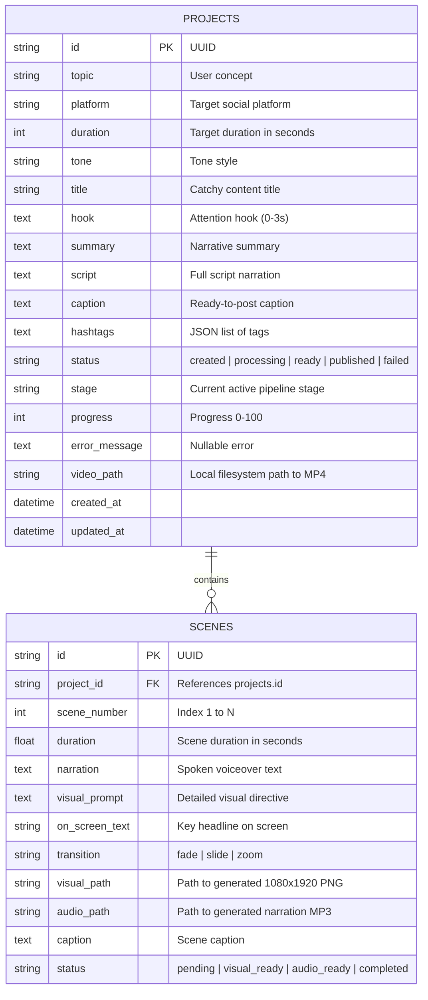
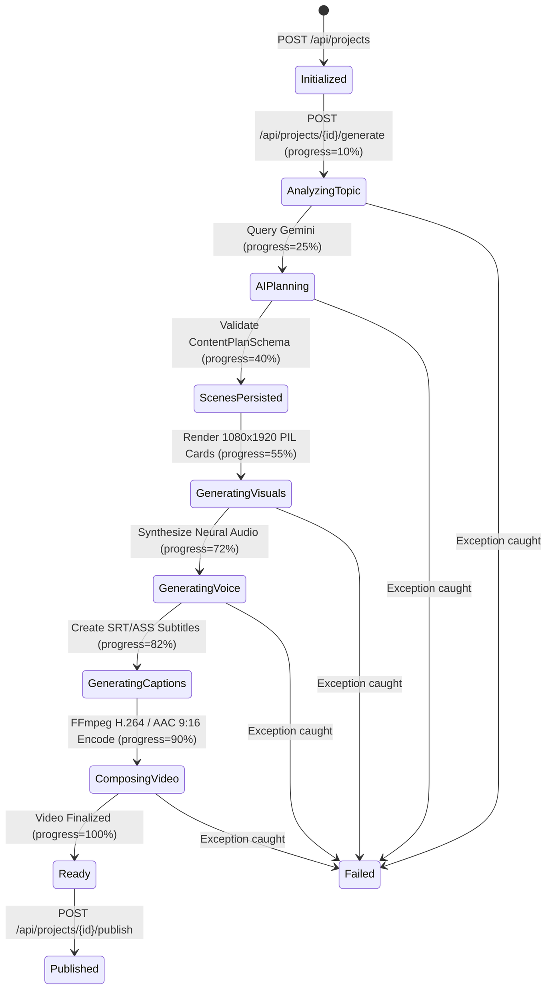

# Qoneqt AI Content Studio — System Architecture

## 1. High-Level System Architecture

The following diagram illustrates the complete end-to-end architecture:

---

## 2. End-to-End Pipeline Execution Flow

---

## 3. Database Entity-Relationship Diagram

---

## 4. Pipeline State Transition Diagram

